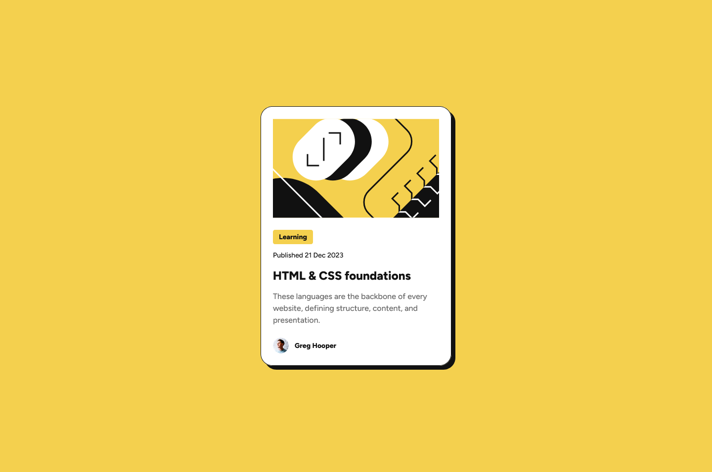

# Frontend Mentor - Blog preview card solution

This is a solution to the [Blog preview card challenge on Frontend Mentor](https://www.frontendmentor.io/challenges/blog-preview-card-ckPaj01IcS). Frontend Mentor challenges help you improve your coding skills by building realistic projects. 

## Table of contents

- [Overview](#overview)
  - [The challenge](#the-challenge)
  - [Screenshot](#screenshot)
  - [Links](#links)
- [My process](#my-process)
  - [Built with](#built-with)
  - [What I learned](#what-i-learned)
  - [Continued development](#continued-development)
  - [Useful resources](#useful-resources)
- [Author](#author)
- [Acknowledgments](#acknowledgments)


## Overview

### The challenge

Users should be able to:

- See hover and focus states for all interactive elements on the page

### Screenshot




### Links

- Solution URL: [Github Repo](https://github.com/laravue-18/frontend-mentor-blog-preview-card.git)
- Live Site URL: [Vercel](https://frontend-mentor-blog-preview-card-ecru.vercel.app/)

## My process

### Built with

- Semantic HTML5 markup
- CSS custom properties
- Flexbox
- Mobile-first workflow


### What I learned

I learned how to apply responsive design using media queries and followed a mobile-first approach.

```css
@media (max-width: 375px) {
  .card__title-label {
    // style here
  }
}
```
I learned about css class naming conventions using BEM (Block Element Modifier), which helped organize the styles more effectively.

### Continued development

I plan to explore more advanced responsive layout techniques and improve accessibility practices in future projects.
### Useful resources

- https://getbem.com/naming/ - This helped me for class naming. I really liked this pattern and will use it going forward.

## Author

- Frontend Mentor - [@laravue-18](https://www.frontendmentor.io/profile/laravue-18)
